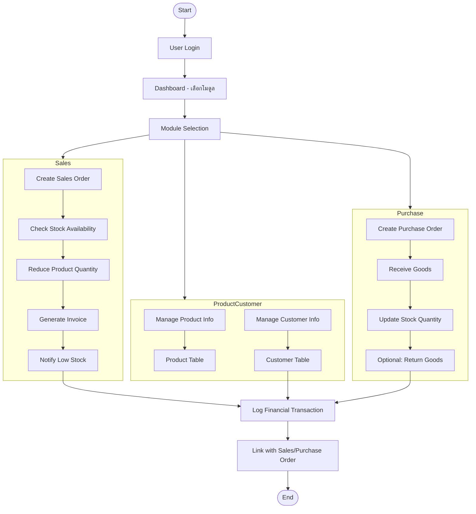
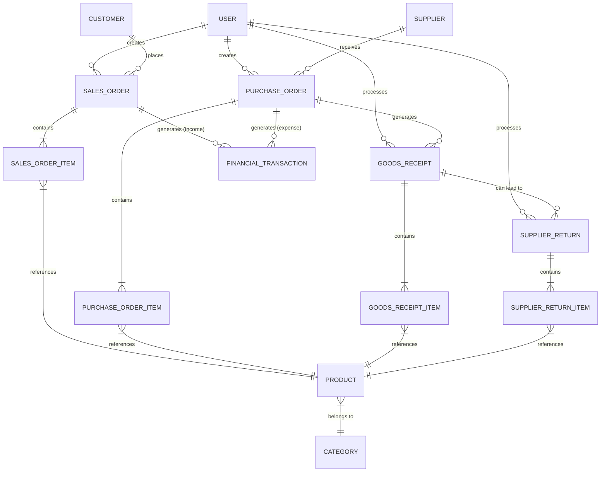

# 🚀 Laravel ERP - ระบบจัดการธุรกิจครบวงจร

[](https://php.net)
[](https://laravel.com)
[](https://livewire.laravel.com)
[](https://tailwindcss.com)

> **[Back to English version (กลับสู่เวอร์ชันภาษาอังกฤษ)](README.md)**

โปรเจกต์ Portfolio สำหรับสร้างระบบ Enterprise Resource Planning (ERP) พื้นฐานด้วยเทคโนโลยีที่ทันสมัย ออกแบบมาเพื่อการจัดการข้อมูลหลักของธุรกิจอย่างมีประสิทธิภาพและมอบประสบการณ์การใช้งานที่รวดเร็ว

---

### ✨ Live Demo

> **[ลิงก์สำหรับ Demo จะถูกเพิ่มที่นี่เมื่อ Deploy เสร็จสิ้น]**

---

### 📸 Screenshots

*(ส่วนนี้สำหรับใส่ภาพหน้าจอของโปรแกรมเมื่อพัฒนาเสร็จแล้ว)*

<p align="center">
  <!--  -->
  <!--  -->
</p>

---

## 🌟 Core Features (คุณสมบัติหลัก)

-   **หน้าแดชบอร์ดสรุปข้อมูล (Dashboard):**
    -   การ์ดข้อมูลสรุปยอดสำคัญ (รายรับ, รายจ่าย, ยอดขายวันนี้, สินค้าสต็อกต่ำ)
    -   กราฟยอดขายพร้อมตัวกรองข้อมูลแบบไดนามิก (7 วัน, เดือนนี้, ปีนี้)
    -   กราฟวงกลมแสดงสัดส่วนสินค้าขายดี 5 อันดับแรก พร้อมเปอร์เซ็นต์

-   **ระบบผู้ใช้งานและสิทธิ์ (Authentication & Authorization):**
    -   ระบบล็อกอิน-ล็อกเอาต์
    -   การจัดการสิทธิ์ตามบทบาท (Role-based Access Control) ด้วย `spatie/laravel-permission`
-   **การจัดการหมวดหมู่ (Category Management):**
    -   ระบบ CRUD (Create, Read, Update, Delete) ที่สมบูรณ์แบบ
    -   จัดการข้อมูลผ่าน Modal ไม่ต้องเปลี่ยนหน้า
    -   ระบบค้นหาแบบ Real-time (Live Search)
    -   ระบบ Soft Deletes พร้อมหน้า "ถังขยะ" สำหรับกู้คืนหรือลบถาวร
-   **การจัดการสินค้า (Product Management):**
    -   ระบบ CRUD ที่สมบูรณ์พร้อมความสัมพันธ์กับตารางหมวดหมู่
    -   ระบบค้นหาจากชื่อสินค้าหรือ SKU
    -   กำหนด "จุดสั่งซื้อขั้นต่ำ" (Minimum Stock Level) สำหรับสินค้าแต่ละชิ้นได้
    -   ระบบ Soft Deletes และ "ถังขยะ"
-   **การจัดการลูกค้า (Customer Management):**
    -   ระบบ CRUD พื้นฐานสำหรับจัดการข้อมูลลูกค้า
-   **การจัดการคำสั่งขาย (Sales Order Management):**
    -   ระบบสร้างใบสั่งขายที่สามารถเลือกสินค้าได้หลายรายการ
    -   คำนวณยอดรวมอัตโนมัติ
    -   แสดงรายการคำสั่งขายทั้งหมด พร้อมระบบค้นหา (ตามเลขที่, ชื่อลูกค้า) และ Pagination
    -   ระบบตรวจสอบสต็อกสินค้าคงเหลือก่อนสร้างใบสั่งขาย
    -   ตัดสต็อกสินค้าอัตโนมัติเมื่อสร้างใบสั่งขาย
-   **ระบบแจ้งเตือนสต็อกต่ำ (Low Stock Notification):**
    -   ระบบตรวจสอบสต็อกสินค้าอัตโนมัติผ่าน Artisan Command (`app:check-low-stock`)
    -   แจ้งเตือนไปยังผู้ดูแลระบบ (Admin) ผ่าน Database Notification เมื่อสินค้าถึงจุดสั่งซื้อขั้นต่ำ
    -   แจ้งเตือนผู้ดูแลระบบเมื่อมี **คำสั่งขาย (Sales Order)** ใหม่เข้ามา
    -   แสดงผลการแจ้งเตือนบน UI ที่เมนูบาร์
-   **ระบบแจ้งเตือนแบบ Real-time (Notification System):**
    -   แจ้งเตือนผู้ดูแลระบบเมื่อมี **คำสั่งขาย (Sales Order)** ใหม่เข้ามา
-   **ระบบจัดซื้อและรับสินค้า (Purchasing & Receiving):**
    -   ระบบ CRUD สำหรับใบสั่งซื้อ (Purchase Order)
    -   ระบบรับสินค้า (Goods Receipt) ที่อ้างอิงจากใบสั่งซื้อ
    -   ระบบคืนสินค้าให้ซัพพลายเออร์ (Supplier Return) พร้อมการตรวจสอบจำนวนที่ซับซ้อนและปรับลดสต็อกอัตโนมัติ
    -   สามารถพิมพ์ใบสั่งซื้อเป็นไฟล์ PDF ได้
-   **ระบบการเงินเบื้องต้น (Finance Module):**
    -   ระบบ CRUD สำหรับบันทึกรายการรายรับ-รายจ่าย
    -   หน้ารายงานสรุปยอดคงเหลือ พร้อมตัวกรองข้อมูลตามช่วงวันที่
    -   แสดงผลสรุปยอดรวมรายรับ, รายจ่าย, และยอดคงเหลือสุทธิ
    -   สามารถ Export รายงานเป็นไฟล์ PDF และ Excel ได้
    **API Development:** (ส่วนนี้ย้ายมาอยู่ด้านบน เพื่อให้อ่านง่ายขึ้น)
    -   สร้าง RESTful API สำหรับโมดูลหลัก (Products, Customers, Sales)
    -   รองรับ Pagination, Filtering, และการแสดงผลข้อมูลรายการเดียว
    -   มีการจัดการเวอร์ชันของ API (API Versioning)
---

## 🌊 ภาพรวมการทำงานของระบบ (System Workflow)



---

## 🛠️ Technology Stack (เทคโนโลยีที่ใช้)

-   **Backend:** Laravel v12
-   **Frontend:** Livewire v3, Tailwind CSS 3.x, Alpine.js
-   **Database:** MySQL / SQLite (สำหรับพัฒนา)
-   **Development Environment:** Docker, Laravel Sail, WSL2 (Ubuntu)

---

## ⚙️ การติดตั้งและรันโปรเจกต์ (Local Setup)

1.  **Clone the repository:**
    ```bash
    git clone https://github.com/kyosuke11z/erp-project.git
    cd erp-project/erp-project
    ```

2.  **Install dependencies:**
    ```bash
    composer install
    npm install
    ```

3.  **Setup environment file:**
    ```bash
    cp .env.example .env
    php artisan key:generate
    ```
    *จากนั้นเข้าไปแก้ไขค่าการเชื่อมต่อฐานข้อมูลในไฟล์ `.env`*

4.  **Build frontend assets:**
    ```bash
    npm run build
    ```

5.  **Run database migrations (and seeder if available):**
    ```bash
    php artisan migrate --seed
    ```

6.  **Start the development server:**
    ```bash
    php artisan serve
    ```

---

## 🗺️ Roadmap (แผนการพัฒนาต่อไป)

-   [x] **Dashboard:** แสดงผลข้อมูลสรุปและกราฟวิเคราะห์ข้อมูล
    -   [x] การ์ดข้อมูลสรุปยอดสำคัญ (รายรับ, รายจ่าย, ยอดขายวันนี้, สินค้าสต็อกต่ำ)
    -   [x] กราฟยอดขายพร้อมตัวกรองข้อมูลแบบไดนามิก (7 วัน, เดือนนี้, ปีนี้)
    -   [x] กราฟวงกลมแสดงสัดส่วนสินค้าขายดี 5 อันดับแรก พร้อมเปอร์เซ็นต์
-   [x] **Customers:** ระบบจัดการข้อมูลลูกค้า
-   [x] **Sales:** ระบบจัดการคำสั่งขาย (Sales Order)
    -   [x] การตัดสต็อกสินค้าอัตโนมัติเมื่อสร้าง/ลบออเดอร์
    -   [x] Export ใบสั่งขาย (Sales Order) เป็น PDF
-   [x] **Purchasing:** ระบบจัดการใบสั่งซื้อ (Purchase Order) และ Supplier
    -   [x] ระบบจัดการข้อมูล Supplier
    -   [x] สร้าง/แก้ไข/ดูรายละเอียด ใบสั่งซื้อ
    -   [x] ระบบรับสินค้า (Goods Receipt) จากใบสั่งซื้อ
    -   [x] ระบบคืนสินค้าให้ซัพพลายเออร์ (Supplier Return)
        -   [x] ตรวจสอบจำนวนที่สามารถคืนได้จากประวัติการคืน
        -   [x] ปรับลดสต็อกสินค้าอัตโนมัติเมื่อทำการคืน
    -   [x] พิมพ์ใบสั่งซื้อเป็น PDF
    -   [x] สร้างหน้าสำหรับแสดงรายการ "ใบคืนสินค้า" (Supplier Return Index/Show)
    -   [x] ในหน้า "รายละเอียดใบรับสินค้า" เพิ่มส่วนแสดงประวัติการคืนสินค้า
-   [x] **Finance:** ระบบบันทึกรายรับ-รายจ่ายเบื้องต้น (เสร็จสมบูรณ์)
    -   [x] เพิ่ม/แก้ไข/ลบ รายการรายรับ/รายจ่าย (แบบ manual)
    -   [x] สรุปยอดคงเหลือ / รายงานรายรับรายจ่าย
    -   [x] Export รายงานเป็น PDF และ Excel
    -   [x] ผูกข้อมูลรายรับกับ Sales Order (กรณีลูกค้าชำระเงิน)
    -   [x] ผูกข้อมูลรายจ่ายกับ Purchase Order
-   [x] **Settings:** หน้าตั้งค่าระบบทั่วไป (ชื่อบริษัท, ที่อยู่, สกุลเงิน, Timezone, รูปแบบวันที่, จำนวนรายการต่อหน้า, การแจ้งเตือนสต็อกต่ำ)
-   [x] **API Development:**
    -   [x] สร้าง RESTful API สำหรับโมดูลหลัก (Products, Customers, Sales)
    -   [x] จัดทำ API Controller และ Resource เพื่อจัดรูปแบบ JSON Response
    -   [x] เพิ่ม Pagination และ Filtering ใน API Response
    -   [x] เพิ่มเมธอด `show` สำหรับดึงข้อมูลรายการเดียว
-   [x] **API Authentication:**
    -   [x] ติดตั้งและใช้งาน Laravel Sanctum สำหรับ Token-based Auth
    -   [x] สร้างระบบ login, logout สำหรับ external client
-   [x] **SQL Query Optimization:**
    -   [x] เขียน Query ที่ซับซ้อนขึ้น เช่น JOIN หลายตาราง, Group By, CTE
    -   [x] รายงานยอดขายรายเดือน / สินค้าขายดี Top N
-   [x] **Testing:**
    -   [x] สร้าง Unit Test สำหรับ Business Logic ที่สำคัญ
    -   [x] เขียน Feature Test สำหรับ API และ Form Submission
-   [x] **Documentation & Presentation:**
    -   [x] เขียน Flowchart และ Diagram ความสัมพันธ์ของระบบ
    -   [x] จัดทำ README ภาษาอังกฤษฉบับย่อ
    -   [ ] เพิ่มภาพตัวอย่าง UI หรือ GIF แสดงการใช้งาน

---

## 📊 Diagram ความสัมพันธ์ของข้อมูล (ER Diagram)



---

## 📄 License

This project is open-source and available under the MIT License.
