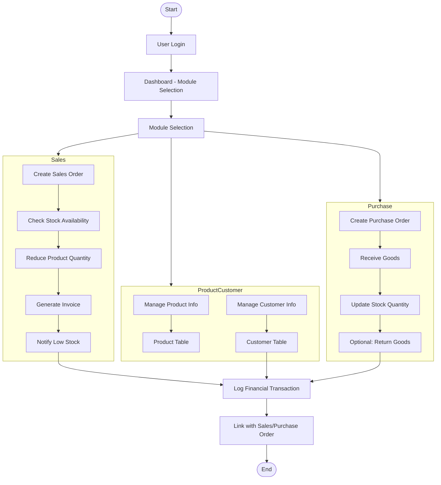
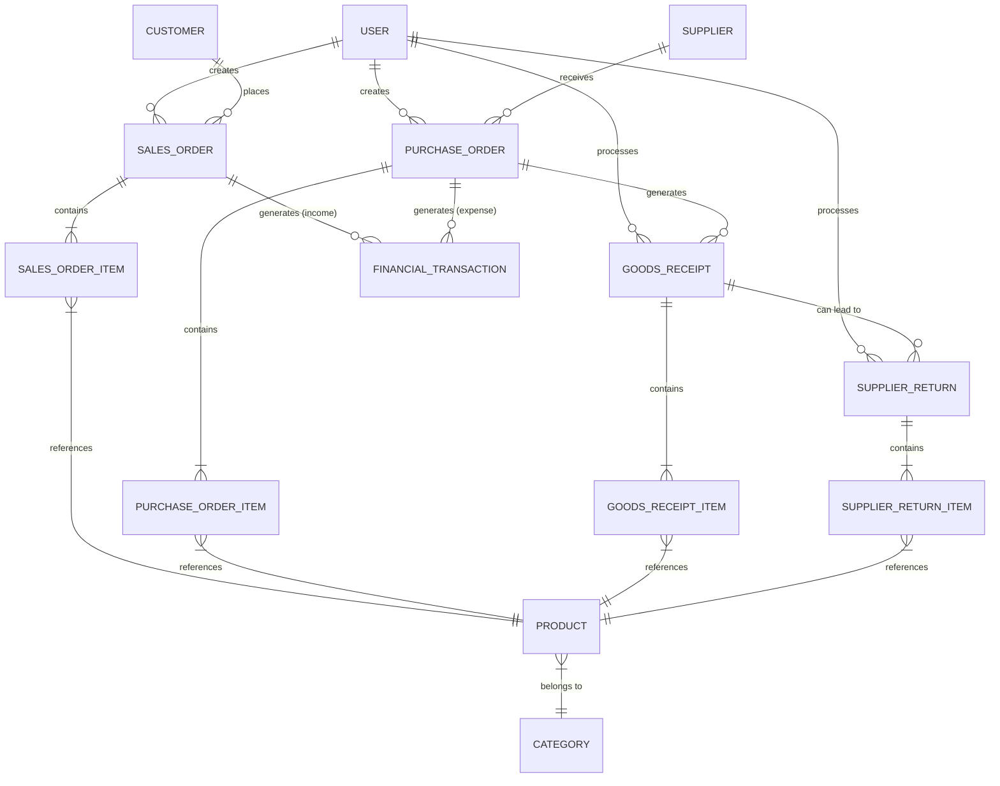

# 🚀 Laravel ERP - A Comprehensive Business Management System

[](https://php.net)
[](https://laravel.com)
[](https://livewire.laravel.com)
[](https://tailwindcss.com)

> **[For the Thai version of this document, click here (สำหรับเอกสารฉบับภาษาไทย คลิกที่นี่)](README.th.md)**

A portfolio project demonstrating a foundational Enterprise Resource Planning (ERP) system built with a modern tech stack. Designed for efficient business data management with a fast, responsive user experience.

---

## 🌟 Core Features

-   **Dynamic Dashboard:**
    -   Key metric cards (Revenue, Expenses, Today's Sales, Low Stock Items).
    -   Dynamic sales chart with filters (Last 7 Days, This Month, This Year).
    -   Pie chart for the top 5 best-selling products.

-   **Authentication & Authorization:**
    -   Login/Logout system.
    -   Role-based Access Control (RBAC) powered by `spatie/laravel-permission`.

-   **Comprehensive CRUD Modules:**
    -   **Product Management:** With category relationships, SKU search, and minimum stock level settings.
    -   **Category Management:** Full CRUD with real-time search and modal-based forms.
    -   **Customer Management:** Basic CRUD for customer data.
    -   **Supplier Management:** For handling purchasing information.

-   **Sales & Inventory Management:**
    -   Create sales orders with multiple items and automatic total calculation.
    -   **Automatic stock deduction** upon order creation using Eloquent Observers.
    -   Real-time stock availability checks.

-   **Purchasing & Receiving:**
    -   Full workflow for Purchase Orders, Goods Receipts, and Supplier Returns.
    -   **Complex validation** for return quantities to prevent data inconsistency.
    -   **Automatic stock updates** upon receiving goods.

-   **Notification System:**
    -   Real-time low stock alerts via Database Notifications.
    -   Notifications for new sales orders.

-   **Basic Finance Module:**
    -   Log income and expense transactions.
    -   Link transactions to Sales and Purchase Orders.
    -   Export financial reports to **PDF and Excel**.

-   **RESTful API:**
    -   API endpoints for core modules (Products, Customers, Sales).
    -   Token-based authentication using **Laravel Sanctum**.
    -   API Resources for structured and safe JSON responses.

---

## 🌊 System Workflow



---

## 📊 Entity-Relationship Diagram



---

## 🛠️ Technology Stack

-   **Backend:** Laravel v12
-   **Frontend:** Livewire v3, Tailwind CSS 4.x, Alpine.js
-   **Database:** MySQL
-   **Development Environment:** Docker, Laravel Sail, WSL2 (Ubuntu)

---

## ⚙️ Local Setup

1.  **Clone the repository:**
    ```bash
    git clone https://github.com/your-username/laravel-erp-portfolio.git
    cd laravel-erp-portfolio
    ```

2.  **Install dependencies:**
    ```bash
    composer install
    npm install
    ```

3.  **Setup environment file:**
    ```bash
    cp .env.example .env
    php artisan key:generate
    ```
    *Then, configure your database connection in the `.env` file.*

4.  **Build frontend assets:**
    ```bash
    npm run build
    ```

5.  **Run database migrations (and seeder if available):**
    ```bash
    php artisan migrate --seed
    ```

6.  **Start the development server:**
    ```bash
    php artisan serve
    ```

---

## 🗺️ Roadmap

-   [x] **Dashboard:** Data summary and analytics graphs.
    -   [x] Key metric cards (Revenue, Expenses, Today's Sales, Low Stock Items).
    -   [x] Dynamic sales chart with filters (7 days, this month, this year).
    -   [x] Pie chart for top 5 best-selling products with percentages.
-   [x] **Customers:** Customer information management system.
-   [x] **Sales:** Sales Order management.
    -   [x] Automatic stock deduction on order creation/deletion.
    -   [x] Export Sales Order as PDF.
-   [x] **Purchasing:** Purchase Order and Supplier management.
    -   [x] Supplier information management system.
    -   [x] Create/Edit/View Purchase Orders.
    -   [x] Goods Receipt system based on Purchase Orders.
    -   [x] Supplier Return system.
        -   [x] Validate returnable quantity based on return history.
        -   [x] Automatic stock deduction on return.
    -   [x] Print Purchase Order as PDF.
    -   [x] Create index/show pages for Supplier Returns.
    -   [x] Add return history section to Goods Receipt details page.
-   [x] **Finance:** Basic income and expense tracking.
    -   [x] Add/Edit/Delete income/expense transactions (manual).
    -   [x] Balance summary / Income-Expense report.
    -   [x] Export reports to PDF and Excel.
    -   [x] Link income records to Sales Orders (on payment).
    -   [x] Link expense records to Purchase Orders.
-   [ ] **Settings:** General settings page (e.g., currency, company name).
-   [x] **API Development:**
    -   [x] Create RESTful API for core modules (Products, Customers, Sales).
    -   [x] Implement API Controllers and Resources for JSON response formatting.
    -   [x] Add Pagination and Filtering to API responses.
    -   [x] Add `show` method for fetching single records.
-   [x] **API Authentication:**
    -   [x] Install and configure Laravel Sanctum for Token-based Auth.
    -   [x] Create login/logout system for external clients.
-   [x] **SQL Query Optimization:**
    -   [x] Write complex queries (e.g., multi-table JOINs, Group By, CTE).
    -   [x] Monthly sales reports / Top N best-selling products.
-   [x] **Testing:**
    -   [x] Create Unit Tests for critical business logic.
    -   [x] Write Feature Tests for API and Form Submissions.
-   [x] **Documentation & Presentation:**
    -   [x] Create Flowchart and ER Diagram.
    -   [x] Create English and Thai READMEs.
-   [ ] **UI/UX:** Add UI screenshots or GIFs for demonstration.

---

## 📄 License

This project is open-source and available under the MIT License.